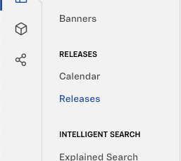
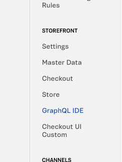
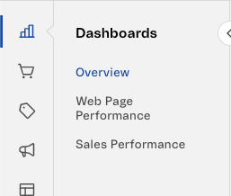

Table of contents

- [`navigation.json`](#navigationjson)
  - [Glossary](#glossary)
  - [Properties](#properties)
    - [Rules of thumb](#rules-of-thumb)
  - [Use cases](#use-cases)
    - [App that **defines a custom sub-section** and place components in it](#app-that-defines-a-custom-sub-section-and-place-components-in-it)
    - [App that **places components under an existent custom sub-section**](#app-that-places-components-under-an-existent-custom-sub-section)
    - [App that **places components under a default sub-section**](#app-that-places-components-under-a-default-sub-section)
  - [`navigation.json` validation](#navigationjson-validation)
    - [Common schema validation fields](#common-schema-validation-fields)
    - [`admin@4.x` `navigation.json` validation schema](#admin4x-navigationjson-validation-schema)
    - [`admin@3.x` `navigation.json` validation schema](#admin3x-navigationjson-validation-schema)

# `navigation.json`

Take these instructions to create the `admin/navigation.json` file of your application.

## Glossary

| Word              | Meaning                                                                                                                                                                                                                                                                                                               |
| ----------------- | --------------------------------------------------------------------------------------------------------------------------------------------------------------------------------------------------------------------------------------------------------------------------------------------------------------------- |
| `navigation.json` | The `navigation.json` is the configuration file of Admin apps. It should be located at the `/admin/navigation.json` folder, [just like in this example](https://github.com/vtex/admin-ui-example/tree/main/admin). This file configuration is responsible for the placement of your application on the Admin sidebar. |
| Settings Block    | A Settings Block is one of the `navigation.json` objects. A `navigation.json` can have a single Settings Block, or multiple Settings Block. This means that the `navigation.json` can be configured as an object, or as an array of objects.                                                                          |
| `section`         | A `section` is one of the Settings Block properties that defines the Sidebar section which a link for an application should be placed.                                                                                                                                                                                |

## Properties

| Property                         | Required | Type                                                                                                                                                                                                                                                                                          | Description                                                                                                                                                                                                                                                                                                                                                                                                                             |
| -------------------------------- | -------- | --------------------------------------------------------------------------------------------------------------------------------------------------------------------------------------------------------------------------------------------------------------------------------------------- | --------------------------------------------------------------------------------------------------------------------------------------------------------------------------------------------------------------------------------------------------------------------------------------------------------------------------------------------------------------------------------------------------------------------------------------- |
| `section` (default sub-sections) | Yes      | For admin@4.x: `gettingStarted`, `main`, `orders`, `marketplace`, `products`, `promotions`, `storeFront`, `shipping`, `storeSettings`, `apps`. For admin@3.x: `main`, `orders`, `transactions`, `products`, `analytics`, `customer`, `storeSetup`, `marketplace`, `accountSettings`, `other`. | Under which section (a.k.a default sub-section) your app should be displayed.section.                                                                                                                                                                                                                                                                                                                                                   |
| `titleId`                        | Yes      | `string`                                                                                                                                                                                                                                                                                      | The ID of the page's title label which is translated to describe a section or subSection, depending on if there is at least one subSection property defined                                                                                                                                                                                                                                                                             |
| `path`                           | No       | `string`                                                                                                                                                                                                                                                                                      | The path of the sub section. In case you are defining a section - if there is at least one `subSection` property defined - you do not need to set anything to this property                                                                                                                                                                                                                                                             |
| `subSection`                     | No       | `string`                                                                                                                                                                                                                                                                                      | In case you are defining a section, you should set this item. This is used to group the sub section items under one sub section of your section. This name can be arbitrary. Keep in mind that it is used as a key so it is possible to insert other apps within it from different apps                                                                                                                                                 |
| `subSectionItems`                | No       | `object`                                                                                                                                                                                                                                                                                      | In case you are defining a section, you should set this item. It is an object which receives at least two parameters, labelId, and path. The labelId should be a translatable string, just as the titleId, and it represents the last leaf from the Sidebar tree, where users will click to navigate to different apps. The path represents the path which users will navigate when they interact with this element.                    |
| `id`                             | No       | `string`                                                                                                                                                                                                                                                                                      | In case you are developing a new version of an existing app that when installed, should replace the existing one, set this property on both, the existing and the new one. This ID is used to remove duplicates. This is an edge case. If you need to set this property, use a short uuid generator such as [short-unique-id](https://shortunique.id/) as a prefix for the ID of your application to minize the chances of duplicatess. |

### Rules of thumb

- The `section` property is always required.
- If the `titleId` property is declared, the `path` property is expected, and vice-versa.
- If the `subSection` property is declared, the `subSectionItems` property is expected, and vice-versa.
  - `subSectionItems` must have at least 1 item.
- Additional properties are forbidden.

## Use cases

### App that **defines a custom sub-section** and place components in it

This use case refers to applications that define their own sub-sections, creating their own sub-section on the Admin sidebar. Take the app vtex.admin-releases, which defines its own `Releases` sub-section, as example:



`titleId`, `subSection` and `subSectionItems` properties are required:

```json
[
  {
    "adminVersion": 4,
    "section": "storeFront",
    "titleId": "admin/releases.admin.menu-section",
    "subSection": "Releases",
    "subSectionItems": [
      {
        "labelId": "admin/releases.admin.menu-section.calendar",
        "path": "/admin/releases/calendar"
      },
      {
        "labelId": "admin/releases.admin.menu-section",
        "path": "/admin/releases"
      }
    ]
  }
]
```

### App that **places components under an existent custom sub-section**

This use case refers to applications that are inserted into an existing custom sub-section. Here is an example of how the app vtex.admin-graphql-ide has configured its `navigation.json`:

```json
[
  {
    "adminVersion": 4,
    "section": "storeSettings",
    "subSection": "storeFront",
    "subSectionItems": [
      {
        "labelId": "admin/layout.title",
        "path": "/admin/graphql-ide"
      }
    ]
  }
]
```



`subSection` and `subSectionItems` are required. The `titleId` property is not used unless the application that has defined the `storeFront` `subSection` first is not installed on the account, thus, it is not required.

### App that **places components under a default sub-section**

This use case refers to applications that are placed under one of the default sub-sections (one of `gettingStarted`, `main`, `orders`, `marketplace`, `products`, `promotions`, `storeFront`, `shipping`, `storeSettings`, `apps` for admin@4.x applications).

vtex.admin-home application `navigation.json` example.

```json
[
  {
    "section": "main",
    "adminVersion": 4,
    "titleId": "admin/home.header.overview",
    "path": "/admin"
  }
]
```

vtex.admin-sales-performance application `navigation.json` example.

```json
[
  {
    "section": "main",
    "adminVersion": 4,
    "titleId": "admin/sales-performance.navigation.label",
    "path": "/admin/sales-performance"
  }
]
```

vtex.admin-webpage-performance application `navigation.json` example.

```json
[
  {
    "section": "main",
    "adminVersion": 4,
    "titleId": "admin/webpage-performance.navigation.label",
    "path": "/admin/webpage-performance"
  }
]
```

How all of them appear under the `main` default section of the Admin:



`path` and `titleId` are required, while `subSection` and `subSectionItems` are forbidden.

## `navigation.json` validation

### Common schema validation fields

```js
const nonNegativeIntegerSchema = {
  type: "integer",
  minimum: 0,
};

const nullableStringSchema = {
  type: "string",
  nullable: true,
};

const subSectionItemsPartialSchema = {
  nullable: true,
  type: "array",
  minItems: 1,
};
```

### `admin@4.x` `navigation.json` validation schema

```js
export default {
  required: ["section", "adminVersion"],
  type: "object",
  additionalProperties: false,
  // See https://json-schema.org/understanding-json-schema/reference/conditionals.html#id4
  dependencies: {
    subSection: ["subSectionItems"],
    subSectionItems: ["subSection"],
    path: ["titleId"],
  },
  // Either require `path`, and `titleId`,
  // `titleId`, `subSection` and `subSectionItems`, or
  // `subSection` and `subSectionItems` only to be present.
  anyOf: [
    // App defines a custom sub-section and places components in it.
    {
      required: ["titleId", "subSection", "subSectionItems"],
    },
    // App places components under an existing custom sub-section.
    {
      required: ["subSection", "subSectionItems"],
      propertyNames: { not: { enum: ["titleId", "path"] } },
    },
    // App places component under the default sub-section.
    {
      required: ["path", "titleId"],
      propertyNames: { not: { enum: ["subSection", "subSectionItems"] } },
    },
  ],
  properties: {
    section: {
      type: "string",
      enum: [
        "gettingStarted",
        "main",
        "orders",
        "marketplace",
        "products",
        "promotions",
        "storeFront",
        "shipping",
        "storeSettings",
        "apps",
      ],
    },
    adminVersion: {
      type: "number",
      enum: [4],
    },
    subSection: {
      ...nullableStringSchema,
    },
    titleId: {
      ...nullableStringSchema,
    },
    path: {
      ...nullableStringSchema,
    },
    id: {
      ...nullableStringSchema,
    },
    LMProductId: {
      ...nullableStringSchema,
    },
    subSectionItems: {
      ...subSectionItemsPartialSchema,
      items: {
        additionalProperties: false,
        type: "object",
        required: ["path", "labelId"],
        properties: {
          path: {
            type: "string",
          },
          labelId: {
            type: "string",
          },
          id: {
            ...nullableStringSchema,
          },
          external: {
            type: "boolean",
            nullable: true,
          },
        },
      },
    },
  },
};
```

### `admin@3.x` `navigation.json` validation schema

```js
export default {
  type: "object",
  required: ["section"],
  additionalProperties: true,
  properties: {
    section: {
      type: "string",
      enum: [
        "main",
        "orders",
        "transactions",
        "products",
        "analytics",
        "customer",
        "storeSetup",
        "marketplace",
        "accountSettings",
        "other",
      ],
    },
    subSection: nullableStringSchema,
    titleId: nullableStringSchema,
    path: nullableStringSchema,
    adminVersion: {
      type: "number",
      enum: [3],
      nullable: true,
    },
    subSectionItems: {
      ...subSectionItemsPartialSchema,
      items: {
        additionalProperties: true,
        type: "object",
        required: ["path", "labelId"],
        properties: {
          path: {
            type: "string",
          },
          labelId: {
            type: "string",
          },
          id: {
            type: "string",
            nullable: true,
          },
          isNew: {
            type: "boolean",
            nullable: true,
          },
          searchKeyWordsHelpers: {
            type: "string",
            nullable: true,
          },
          external: {
            type: "boolean",
            nullable: true,
          },
        },
      },
    },
  },
};
```
